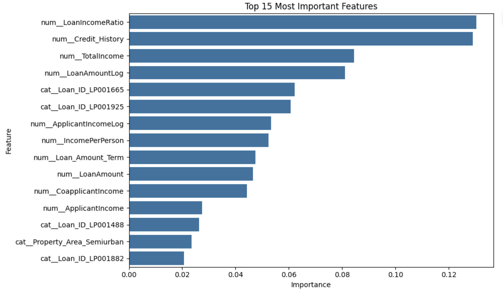
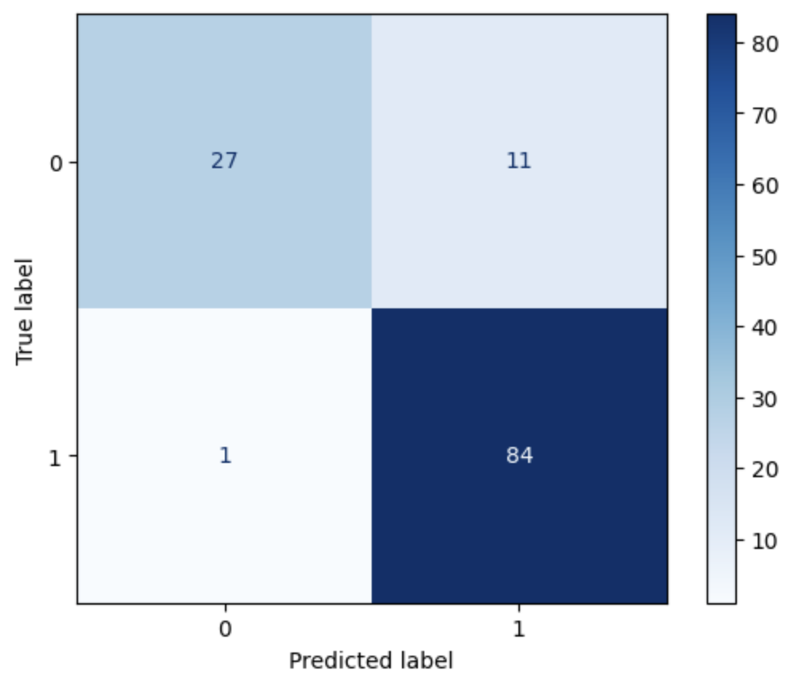
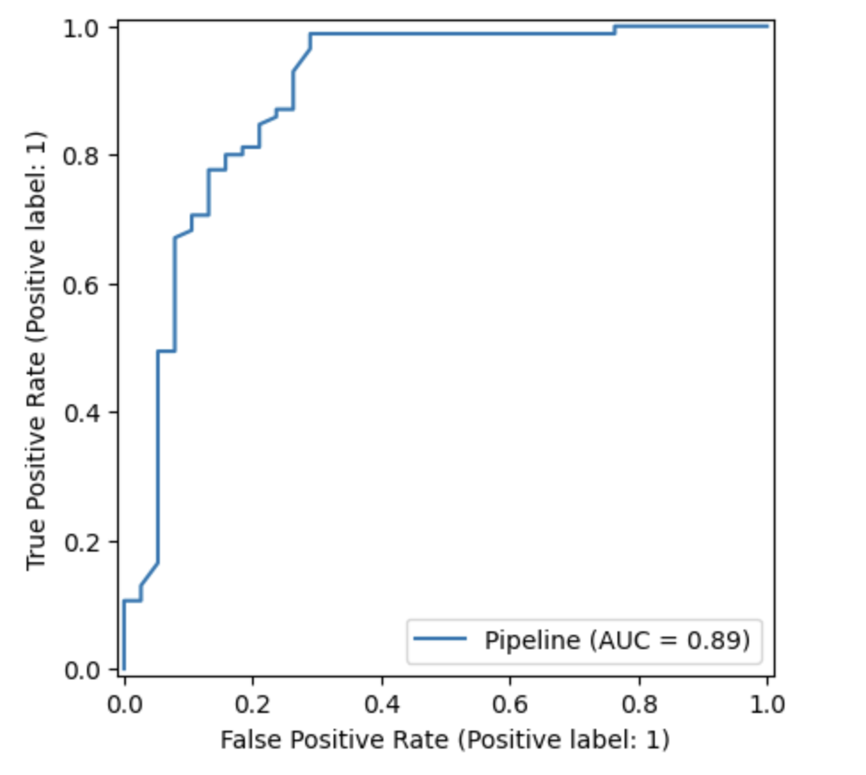
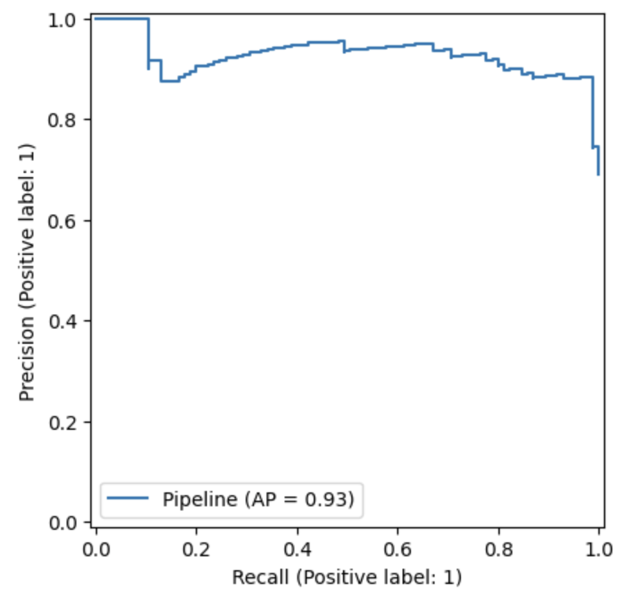

# 🏦 Loan Approval Prediction using Ensemble Learning

<p align="center">


</p>

---

# 📸 Project Preview

<p align="center">


</p>

---

# 📌 Project Overview

This project predicts whether a loan application will be **Approved** or **Rejected** using multiple Machine Learning classification algorithms, with a primary focus on **Ensemble Learning**.

The notebook demonstrates a complete end-to-end Machine Learning workflow including:

- 📊 Exploratory Data Analysis
- 🧹 Data Cleaning
- ⚙️ Feature Engineering
- 🏗️ Scikit-Learn Pipeline
- 🤖 Model Comparison
- 🔍 Hyperparameter Tuning
- 📈 Model Explainability

---

# 🎯 Problem Statement

Financial institutions receive thousands of loan applications every year.

The objective is to build a Machine Learning model capable of accurately predicting loan approval decisions based on applicant information while comparing multiple Ensemble Learning algorithms.

---

# 📂 Dataset

**Dataset:** Loan Prediction Dataset

**Target Variable**

| Value | Meaning |
|-------|---------|
| 1 | Loan Approved |
| 0 | Loan Rejected |

---

# ⚙️ Tech Stack

- Python
- Pandas
- NumPy
- Scikit-Learn
- Matplotlib
- Seaborn
- Joblib

---

# 🚀 Project Workflow

```
Raw Dataset
      │
      ▼
Data Understanding
      │
      ▼
Exploratory Data Analysis
      │
      ▼
Missing Value Handling
      │
      ▼
Feature Engineering
      │
      ▼
Preprocessing Pipeline
      │
      ▼
Model Training
      │
      ▼
Model Evaluation
      │
      ▼
Hyperparameter Tuning
      │
      ▼
Feature Importance
      │
      ▼
Final Model
```

---

# 🏗️ Feature Engineering

The following features were created:

- ✅ Total Income
- ✅ Loan Income Ratio
- ✅ Family Size
- ✅ Income Per Person
- ✅ Log Applicant Income
- ✅ Log Loan Amount

---

# 🤖 Models Compared

- Logistic Regression
- Decision Tree
- Random Forest
- Extra Trees Classifier
- AdaBoost Classifier
- Gradient Boosting Classifier
- HistGradient Boosting Classifier

---

# 📊 Model Performance

| Model | Accuracy | Precision | Recall | F1 Score | ROC-AUC |
|--------|----------|-----------|--------|----------|---------|
| 🥇 AdaBoost | **90.24%** | **88.42%** | **98.82%** | **93.33%** | **84.94%** |
| Logistic Regression | 86.18% | 84.00% | 98.82% | 90.81% | 78.36% |
| Gradient Boosting | 86.18% | 86.17% | 95.29% | 90.50% | 80.54% |
| Extra Trees | 85.37% | 83.17% | 98.82% | 90.32% | 77.04% |
| Random Forest | 85.37% | 83.84% | 97.65% | 90.21% | 77.77% |
| HistGradient Boosting | 82.11% | 86.21% | 88.24% | 87.21% | 78.33% |
| Decision Tree | 78.05% | 88.16% | 78.82% | 83.23% | 77.57% |

---

# 🏆 Best Performing Model

**AdaBoost Classifier**

✔ Accuracy : **90.24%**

✔ Precision : **88.42%**

✔ Recall : **98.82%**

✔ F1 Score : **93.33%**

✔ ROC-AUC : **84.94%**

---

# 📈 Visualizations

## Model Comparison


---

## Feature Importance



---

## Confusion Matrix



---

## ROC Curve



---

## Precision-Recall Curve



---

# 📁 Repository Structure

```
loan-approval-prediction/

│
├── notebook/
│   └── loan_approval_prediction.ipynb
│
├── images/
│   ├── target_distribution.png
│   ├── model_comparison.png
│   ├── feature_importance.png
│   ├── confusion_matrix.png
│   ├── roc_curve.png
│   └── precision_recall_curve.png
│
├── models/
│   └── loan_approval_model.pkl
│
├── requirements.txt
├── README.md
├── LICENSE
└── .gitignore
```

---

# 💡 Future Improvements

- XGBoost
- LightGBM
- CatBoost
- SHAP Explainability
- Streamlit Deployment
- Docker Deployment

---

# 👨‍💻 Author

**Yuwin / Godofthunder2407**

🌐 GitHub

https://github.com/Yuwin2008

🌐 Discord Username

godofthunder_2407

---

If you found this project useful, consider giving it a ⭐.
